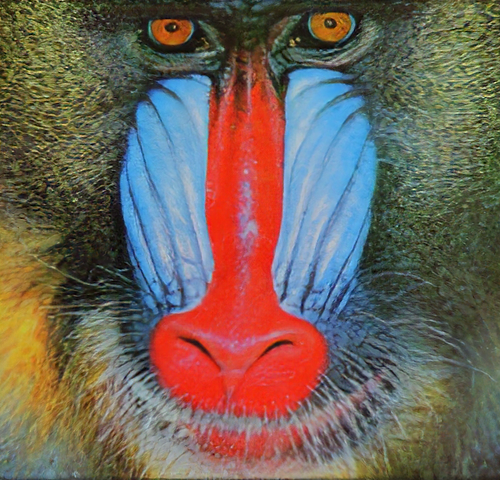

# Deep Learning Super-Resolution

[Deep-Learning-Super-Resolution](https://github.com/Pakleni/Deep-Learning-Super-Resolution) was used as a basis for this project.
It includes different loss functions and models and was made as a project for university by me and my friend [Mihailo Pacaric](https://github.com/mihailopacaric).

---

This code is an implementation of the [SRGAN Paper](https://arxiv.org/abs/1609.04802).

I trained a recreated version of their SRResNet and SRGAN.
Also included is a trained modified version of their generation network which was made for 2 x upscaling.

---

The tensorflow model source code can be found at `dlsr/models`.

The perceptual loss that was used can be found at `dlsr/losses/srgan.py`

The dataset I used was DIV2K and the code for loading the dataset can be found at `dlsr/data/div2k.py`, it is a modified version of code found [here](https://github.com/krasserm/super-resolution/blob/179320c5cb005f57cd7e126cd8b3b669c793585a/data.py).

---

## 4x Upscaling images

### Validation Set

<table>
  <th>Low Resolution</th>
  <th>SRResNet 4x</th>
  <th>SRGAN 4x</th>
  <tr>
    <td></td>
    <td></td>
    <td></td>
  </tr>
  <tr>
    <td></td>
    <td></td>
    <td></td>
  </tr>
  <tr>
    <td></td>
    <td></td>
    <td></td>
  </tr>
<table>

### Set14

<table>
  <th>Low Resolution</th>
  <th>SRResNet 4x</th>
  <th>SRGAN 4x</th>
  <tr>
    <td></td>
    <td></td>
    <td></td>
  </tr>
  <tr>
    <td></td>
    <td></td>
    <td></td>
  </tr>
  <tr>
    <td></td>
    <td></td>
    <td></td>
  </tr>
<table>

### Other

Note: Python 3.10.5 was used
